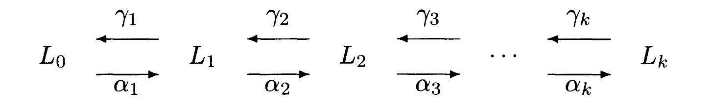

<!-- style: header -->


# Systematic Design of Galois Connections

Yuchi Yamaguchi 2025/08/05

---

<!-- _header: おさらい -->
<br>
<br>


<div class="def">

### [Def1: Galois 接続 (Galois Connection)]

半順序集合 $(L, \leq_L)$, $(M, \leq_M)$, $\alpha: L \to M$, $\gamma: M \to L$ が

<hr>

1. $\alpha$, $\gamma$ は単調
2. 任意の $l \in L$, $m \in M$ に対して
$$
\begin{align*}
l \leq_L \alpha(\gamma(m)) \\
\gamma(\alpha(l)) \leq_M m
\end{align*}
$$

<hr>

を満たすとき $(L, \alpha, \gamma, M)$ は **Galois 接続 (Galois Connection)** であるという． とくに $\alpha \circ \gamma = \text{id}_M$ のとき **Galois 挿入 (Galois Insertion)** という．
</div>

---

<!-- _header: 諸性質 -->

<br>


<div class="thm" style="font-size: 0.85em">

### [Galois 接続の諸性質]


<div class="columns">


<div>

- $(L, \alpha, \gamma, M)$ が Galois 接続
  $\iff (L, \alpha, \gamma, M)$ は随伴

- $\gamma$ は $\alpha$ によって一意に定まる．

- $V, M$ の正当性関係 $R$, $(L, \alpha, \gamma, M)$: Galois 接続により $S$ を $v \mathrel S m \iff v \mathrel R \gamma(m)$ と定めたとき $S$ も正当性関係

- extraction function $\eta: V \to D$ から Galois 接続を構成できる

</div>


<div>


- $(L, \alpha, \gamma, M)$ が Galois 挿入
  $\iff$ $\alpha$ が全射
  $\iff$ $\gamma$ が単射
  $\iff$ $\alpha$ が順序を保つ

- $(L, \alpha, \gamma, M)$ が Galois 接続
  $\implies$ reduction operator $\varsigma: M \to M$  により Galois 挿入を構成できる


</div>


</div>

---

<!-- _header: 段階的に Galois 接続を設計する -->

モチベーション:
- ## ✔️ プログラム解析を「徐々に」作っていきたい
  - 最初はざっくりした解析
    - だんだん本当に欲しいものがわかってくるにつれてまさにそれを実現するように更新していきたい
  - いくつかの簡単な解析だけつくる
    - 組み合わせていい感じに複雑な解析にしたい

---

<!-- _header: 段階的に Galois 接続を設計する -->

<br>

<br>


$L_0$: 設計が簡単な性質の表現
$L_1$: より求めているものに近いもの
$L_2$: さらに求めているものに近いもの
$\ldots$
$L_n$: 求めているもの

と段階的に設計できるか？

($=$ 複数の Galois 接続を <span class="dot-text">組み合わせ</span> たとき，いい性質は保たれる？)




---

<!-- _header: Galois 接続を直列に繋ぐ -->

<br>

A. できる．例えば:

<div class="thm">

### [Thm1: Galois 接続の合成]

Galois 接続 $(L_0, \alpha_0, \gamma_0, M_0)$, $(L_1, \alpha_1, \gamma_1, M_1)$ に対して

$$
(L_0, \alpha_1 \circ \alpha_0, \gamma_0 \circ \gamma_1, M_1)
$$

は **Galois 接続** である．

</div>

(proof)
それぞれの随伴性から
$\alpha_1(\alpha_0(l_0)) \leq_{M_1} m_1 \iff \alpha_1(l_0) \leq_{M_1} \gamma_1(m_1) \iff l_0 \leq_{L_0} \gamma_0(\gamma_1(m_1))$.

---

<!-- _header: Galois 接続を直列に繋ぐ -->


<div class="thm">

### [Thm2: Galois 挿入の合成]

Galois 挿入 $(L_0, \alpha_0, \gamma_0, M_0)$, $(L_1, \alpha_1, \gamma_1, M_1)$ に対して

$$
(L_0, \alpha_1 \circ \alpha_0, \gamma_0 \circ \gamma_1, M_1)
$$

は **Galois 挿入** である．

</div>

(proof)
単射の合成は単射なので $\alpha_1 \circ \alpha_0$ は単射であることからしたがう．

---

<!-- _header: Galois 接続を直列に繋ぐ -->
<br>

(インデックス上限, アクセスするインデックス) $\in \mathbb{Z} \times \mathbb{Z}$ を検査したい．

<div class="box">

## [<span class="orangelined">第一段階</span> の抽象化]


extraction function: $\text{diff}: \mathbb{Z} \times \mathbb{Z} \to \mathbb{Z}$ を

$$
\text{diff}(x, y) = | x | - | y |
$$

によって定める．すると Galois 接続 $(\mathcal{P}(\mathbb{Z} \times \mathbb{Z}), \alpha_{\text{diff}}, \gamma_{\text{diff}}, \mathcal{P}(\mathbb{Z}))$ は

$$
\begin{align*}
\alpha_{\text{diff}}(ZZ') &= \{ |z1| - |z2| \mid (z1, z2) \in ZZ' \} \\
\gamma_{\text{diff}}(Z') &= \{ (z1, z2) \mid |z1| - |z2| \in Z' \}
\end{align*}
$$

</div>

---

<!-- _header: Galois 接続を直列に繋ぐ -->

<br>
<br>

<div class="box">


## [<span class="orangelined">第二段階</span> の抽象化]

extraction function: $\text{range}: \mathbb{Z} \to \textbf{Range}$　を

$$
\text{range}(z) = \begin{cases}
\texttt{<-1} & \quad z < -1 \\
\texttt{-1} & \quad z = -1 \\
\texttt{0} & \quad z = 0 \\
\texttt{1} & \quad z = 1 \\
\texttt{>+1} & \quad z > 1
\end{cases}
$$


によって定める．すると Galois 接続 $(\mathcal{P}(\textbf{Range}), \alpha_{\text{range}}, \gamma_{\text{range}}, \mathcal{P}(\mathbb{Z}))$ は

$$
\begin{align*}
\alpha_{\text{range}}(Z') &= \{ \text{range}(z) \mid z \in Z' \} \\
\gamma_{\text{range}}(R) &= \{ z \mid \text{range}(z) \in R \}
\end{align*}
$$

</div>

---

<!-- _header: Galois 接続を直列に繋ぐ -->

Thm1 からこれの合成も Galois 接続をなす．


$$
(\mathcal{P}(\mathbb{Z} \times \mathbb{Z}), \alpha_{\text{range}} \circ \alpha_{\text{diff}}, , \gamma_{\text{diff}} \circ \gamma_{\text{range}}, \textbf{Range})
$$

where

$$
\begin{align*}
\alpha_{\text{range}} \circ \alpha_{\text{diff}}(ZZ') &= \{ \text{range}(|z1| - |z2|) \mid (z1, z2) \in ZZ' \} \\
\gamma_{\text{diff}} \circ \gamma_{\text{range}}(R) &= \{ (z1, z2) \mid \text{range}(|z1| - |z2|) \in R \}
\end{align*}
$$


---

<!-- _header: Galois 接続を直列に繋ぐ -->

## ✅ パターン1. Galois 接続の <span class="dot-text" style="color:black; important!">直列</span> 合成．

真に解析したいもの (インデックスの upper bound 付近での振る舞い) を考えなくても中間的なものから考えられる．

---

<!-- _header: 段階的に Galois 接続を設計する -->

## ✅ パターン2. Galois 接続の <span class="dot-text">並列 (?)</span> 合成．

複数の解析を組み合わせてより複雑な解析を作る．

---

 <!-- _header: Galois 接続を並列に繋ぐ -->

<br>

<div class="thm">

### [Thm3: Galois 接続の直積]

Galois 接続 $(L_0, \alpha_0, \gamma_0, M_0)$, $(L_1, \alpha_1, \gamma_1, M_1)$ に対して，

$$
\begin{align*}
\alpha(l_0, l_1) &= (\alpha_0(l_0), \alpha_1(l_1)) \\
\gamma(m_0, m_1) &= (\gamma_0(m_0), \gamma_1(m_1)) \\
(l_0, l_1) \leq_{L_0 \times L_1} (m_0, m_1) &\iff l_0 \leq_{L_0} m_0 \land l_1 \leq_{L_1} m_1 \\
(m_0, m_1) \leq_{M_0 \times M_1} (l_0, l_1) &\iff m_0 \leq_{M_0} l_0 \land m_1 \leq_{M_1} l_1
\end{align*}
$$

と定めたとき $(L_0 \times L_1, \alpha, \gamma, M_0 \times M_1)$ は **Galois 接続**．

</div>

(proof)
随伴性をそのまま確認すればよい．

---

<!-- _header: 段階的に Galois 接続を設計する -->

<br>

## (例) 2 つの符号解析の Galois 接続の直積

extraction function: $\text{sign}: \mathbb{Z} \to \textbf{Sign}$ から構成される Galois 接続

$$
(\mathcal{P}(\mathbb{Z}), \alpha_{\text{sign}}, \gamma_{\text{sign}}, \mathcal{P}(\textbf{Sign}))
$$

2 つから

$$
(\mathcal{P}(\mathbb{Z}) \times \mathcal{P}(\mathbb{Z}), \alpha_{\textbf{SS}}, \gamma_{\textbf{SS}}, \mathcal{P}(\textbf{Sign}) \times \mathcal{P}(\textbf{Sign}))
$$

where

$$
\begin{align*}
\alpha_{\textbf{SS}}(Z_1, Z_2) &= (\alpha_{\text{sign}}(Z_1), \alpha_{\text{sign}}(Z_2)) \\
\gamma_{\textbf{SS}}(R_1, R_2) &= (\gamma_{\text{sign}}(R_1), \gamma_{\text{sign}}(R_2))
\end{align*}
$$

は Thm3 により Galois 接続.


---


 <!-- _header: Galois 接続を並列に繋ぐ -->

とりあえず Galois 接続自体はできた．が

**Q. 二つの解析は完全に独立だが，これで良い？**

---


<!-- _header: 複数の解析結果の関係を表現する -->

✅ **二つの解析が独立でないことがある**


```python
x = random_choice_from([+2, 0, -2]) # +2, 0, -2 のいずれか
　　 (x, -x)                         # <- この組を解析したい
```

<div class="center">

⇩
**ありえる組は** $(\mathtt{+}, \mathtt{-}), (\mathtt{0}, \mathtt{0}), (\mathtt{-}, \mathtt{+})$ **のいずれか**

</div>


---

<!-- _header: 複数の解析結果の関係を表現する -->


単に直積を取るだけだと...

$x_1 = \{2, 0, -2\}$, $x_2 = \{2, 0, -2\}$ なので

$$
\alpha_{\textbf{SS}}( ( \{2, 0, -2\} \times \{2, 0, -2\} )) = (\{\mathtt{+}, \mathtt{0}, \mathtt{-}\}, \{\mathtt{+}, \mathtt{0}, \mathtt{-}\})
$$

<br>

<div class="center">


<span class="red">🙅 解析間の相対的な関係が失われている！</span>


</div>


---

<!-- _header: 複数の解析結果の関係を表現する -->

本当に欲しいもの:

$$
\Large{
\alpha_{\textbf{SS}}( \{ (2, -2), (0, 0), (-2, 2) \} ) = \{ (\mathtt{+}, \mathtt{-} ), (\mathtt{0}, \mathtt{0}), (\mathtt{-}, \mathtt{+}) \}}
$$


---

<!-- _header: 複数の解析結果の関係を表現する -->


<div class="thm" style="font-size: 0.85em">

### [Thm4: Galois 接続の直積 ②]

Galois 接続 $(\mathcal{P}(V_1), \alpha_1, \gamma_1, \mathcal{P}(D_1))$ と $(\mathcal{P}(V_2), \alpha_2, \gamma_2, \mathcal{P}(D_2))$
に対して， $(\mathcal{P}(V_1 \times V_2), \alpha, \gamma, \mathcal{P}(D_1 \times D_2))$

where

$$
\begin{align*}
\alpha(VV') &= \bigcup \{ {\alpha_1(\{ v_1 \}) \times \alpha_2(\{ v_2 \}) \mid (v_1, v_2) \in VV'} \} \\
\gamma(DD') &= \{ (v_1, v_2) \mid \alpha_1( \{ v_1 \} \times \alpha_2( \{ v_2 \})) \subseteq DD' \}
\end{align*}
$$

は **Galois 接続**．

</div>

(proof)
$\alpha$ の完全加法性から $\gamma$ が存在して $(\mathcal{P}(V_1 \times V_2), \alpha, \gamma, \mathcal{P}(D_1 \times D_2))$ が Galois 接続をなす．あとは $\gamma$ の一意性から確かめればよい．


---

<!-- _header: 複数の解析結果の関係を表現する -->

例: 符号解析の組み合わせ

$$
\begin{align*}
\alpha_{\textbf{SS}}(\{ (2, -2), (0, 0), (-2, 2) \}) &= \bigcup \{ \alpha_{\text{sign}}(\{2\}) \times \alpha_{\text{sign}}(\{-2\}), \alpha_{\text{sign}}(\{0\}) \times \alpha_{\text{sign}}(\{0\}), \alpha_{\text{sign}}(\{-2\}) \times \alpha_{\text{sign}}(\{2\}) \} \\
&= \{ (\mathtt{+}, \mathtt{-}), (\mathtt{0}, \mathtt{0}), (\mathtt{-}, \mathtt{+}) \}
\end{align*}
$$

<div class="center">

<br>

✅ **二つの解析の相対的な関係を失わず表現できた!**


</div>

---

<!-- _header: 同じ値に対する複数の解析を統合する -->

<br>

同じ値に対する複数の解析をまとめて扱うこともできる．

<div class="thm" style="font-size: 0.85em">

### [Thm5: Galois 接続の直積 ③]

Galois 接続 $(L, \alpha_1, \gamma_1, M_1)$ と $(L, \alpha_2, \gamma_2, M_2)$ に対して
$\alpha: L \to M_1 \times M_2$, $\gamma: M_1 \times M_2 \to L$ を

$$
\begin{align*}
\alpha(l) &= (\alpha_1(l), \alpha_2(l)) \\
\gamma(m_1, m_2) &= \gamma_1(m_1) \sqcap \gamma_2(m_2)
\end{align*}
$$

によって定めたとき $(L, \alpha, \gamma, M_1 \times M_2)$ は **Galois 接続**．

</div>

(proof)
随伴性をそのまま確認すればよい．

---

<!-- _header: 同じ値に対する複数の解析を統合する -->

```python
x = random_choice_from([+2, 0, -2]) # +2, 0, -2 のいずれか
　　 (x, 3 * x)
```

では，

$$
\alpha (\{ (2, 6), (0, 0), (-2, -6) \}) = \{ \{ (\mathtt{+}, \mathtt{+}), (\mathtt{0}, \mathtt{0}), (\mathtt{-}, \mathtt{-}) \}, \{  \mathtt{0}, \mathtt{<-1} \} \}
$$


⇨ <span class="red"> 🙅 解析間の相対的な関係 ($(0, 0)$ のとき絶対値の差は $0$) が失われている </span>

---

<!-- _header: 同じ値に対する複数の解析を統合する -->

<div class="thm">

### [Thm6: Galois 接続の直積 ④]

Galois 接続 $(\mathcal{P}(V), \alpha_1, \gamma_1, \mathcal{P}(D_1))$ と $(\mathcal{P}(V), \alpha_2, \gamma_2, \mathcal{P}(D_2))$ に対して
$\alpha: \mathcal{P}(V) \to \mathcal{P}(D_1 \times D_2)$, $\gamma: \mathcal{P}(D_1 \times D_2) \to \mathcal{P}(V)$ を

$$
\begin{align*}
\alpha(V') &= \bigcup \{ \alpha_1(\{ v \}) \times \alpha_2(\{ v \}) \mid v \in V' \} \\
\gamma(DD') &= \{ v \mid \alpha_1(\{ v \}) \times \alpha_2(\{ v \}) \subseteq DD' \}
\end{align*}
$$

によって定めたとき $(\mathcal{P}(V), \alpha, \gamma, \mathcal{P}(D_1 \times D_2))$ は **Galois 接続**．

</div>

(proof)

Thm4 と同じ.

---

<!-- _header: 同じ値に対する複数の解析を統合する -->
$$
\begin{align*}
\alpha_(\{ (2, 6),\ (0, 0),\ (-2, -6) \})
&= \bigcup \Big\{ \\
&\quad\
   \alpha_{\text{sign}}(\{ (2, 6) \})
   \times
   \alpha_{\text{sign}}(\{ (2, 6) \}), \\
&\quad\
   \alpha_{\text{sign}}(\{ (0, 0) \})
   \times
   \alpha_{\text{sign}}(\{ (0, 0) \}), \\
&\quad\
   \alpha_{\text{sign}}(\{ (-2, -6) \})
   \times
   \alpha_{\text{sign}}(\{ (-2, -6) \})
\Big\} \\
&= \{
   (\mathtt{+},\ \mathtt{<-1}),\
   (\mathtt{0},\ \mathtt{0}),\
   (\mathtt{-},\ \mathtt{<-1})
\}
\end{align*}
$$

<div class="center">

## ✅ 二つの解析を関連づけることができた！

</div>

---

<!-- _header: reduction operator による Galois 挿入の構成 -->

Galois 接続なのでもちろん recution operator $\varsigma$  によって Galois 挿入にできる．

⇨ $(\mathtt{0}, \mathtt{0}, \mathtt{+1})$ のような対応する具体的な値がないものは除去可能.

---


<!-- _header: 環境と抽象状態の Galois 接続の構成 -->


✅ 多くの解析は，環境:  $\textbf{Env}: \textbf{Var} \to \textbf{Value}$ の推移を調べる．

⇨ Q. 値と性質の間の Galois 接続から，環境の解析のための Galois 接続:

- 環境: $\textbf{Env}: \textbf{Var} \to L$　と
- 抽象状態: $\textbf{Env}: \textbf{Var} \to M$ の間の Galois 接続を構成できるか？

---

<!-- _header: 環境と抽象状態の Galois 接続の構成 -->

A. できる．

<div class="thm" style="font-size: 0.75em;">

### [Thm7: Concrete/Abstract Value への写像全体の Galois 接続]

  Galois 接続 $(L, \alpha, \gamma, M)$ と 集合 $S$ に対して，
  $\alpha': (S \to L) \to (S \to M)$, $\gamma': (S \to M) \to (S \to L)$を

  $$
  \begin{align*}
    \alpha'(f) & = \alpha \circ f \\
    \gamma'(g) & = \gamma \circ g
  \end{align*}
  $$

  $S \to L$ と $S \to M$ 上 の順序 $\leq_{S \to L}$, $\leq_{S \to M}$ を

  $$
  \begin{align*}
    f \leq_{S \to L} f' & \iff \forall s \in S, f(s) \leq_L f'(s) \\
    g \leq_{S \to M} g' & \iff \forall s \in S, g(s) \leq_M g'(s)
  \end{align*}
  $$

  によって定めれば $(S \to L, \leq_{S \to L})$ と $(S \to M, \leq_{S \to M})$ は半順序であって
  $(S \to L, \alpha', \gamma', S \to M)$ は Galois 接続．

</div>

---

(proof)


随伴であることから示す．

$\alpha'$, $\gamma'$ は全域．

$f \in S \to L, g \in S \to M$ に対して

$$
\begin{align*}
  \alpha'(f) \leq_{S \to M} g & \iff \forall s \in S, \alpha(f(s)) \leq_M g(s) & \text{(Definition of $\leq_{S \to M}$)}                 \\
                              & \iff \forall s \in S, f(s) \leq_L \gamma(g(s)) & \text{( $(L, \alpha, \gamma, M)$ is Galois connection)} \\
                              & \iff f \leq_{S \to L} \gamma'(g)               & \text{(Definition of $\leq_{S \to L}$)}                 \\
  \\
\end{align*}
$$

$\therefore$ $(S \to L, \alpha', \gamma', S \to M)$ は Galois 接続．

---

<!-- _header: 環境と抽象状態の Galois 接続の構成 -->

**✅ 具体的な値 $L$ と抽象的な値 $M$ との Galois 接続さえあれば**

**$\textbf{Var} \to L$ と**
**$\textbf{Var} \to M$ の Galois 接続を設計できる！**

---

<!-- _header: 遷移の間の Galois 接続の構成 -->

**✅ 多くの解析では状態の遷移:**

$$
(\textbf{Var} \to L) \to (\textbf{Var} \to L)
$$


**を扱う．これと抽象状態の遷移:**
$$
(\textbf{Var} \to M) \to (\textbf{Var} \to M)
$$

**の間の Galois 接続を構成できるか？**


---

<!-- _header: 遷移の間の Galois 接続の構成 -->


<div class="thm" style="font-size: 0.75em;">

### [Thm8: 二つの Galois 接続の間の単調写像全体の Galois 接続]

  Galois 接続 $(L_0, \alpha_0, \gamma_0, M_0)$ と $(L_1, \alpha_1, \gamma_1, M_1)$ に対して

  $\mathcal{F}_0$ を $L_0 \to L_1$ の単調写像全体の集合，$\mathcal{F}_1$ を $M_0 \to M_1$ の単調写像全体の集合として，
  $\alpha: \mathcal{F}_0 \to \mathcal{F}_1$, $\gamma: \mathcal{F}_1 \to \mathcal{F}_0$ を

  $$
  \begin{align*}
    \alpha(f) & = \alpha_1 \circ f \circ \gamma_0 \\
    \gamma(g) & = \gamma_1 \circ g \circ \alpha_0
  \end{align*}
  $$

  と定めたとき
  $(\mathcal{F}_0, \alpha, \gamma, \mathcal{F}_1)$ は Galois 接続．
</div>


---

<div style="font-size: 0.75em;">

(proof)

$\alpha_1$, $\gamma_1$, $\alpha_2$, $\gamma_2$ の単調性から $\alpha$, $\gamma$ も単調．

$l_1 \in L_1$, $f \in \mathcal{F}_L$ に対して

$$
\begin{align*}
  l_1              & \leq_{L_1} \gamma_1(\alpha_1(l_1))              & \text{($(L_1, \alpha_1, \gamma_1, M_1)$ is Galois connection)} \\
  \implies  f(l_1) & \leq_{L_2} f(\gamma_1(\alpha_1(l_1)))           & \text{(Monotonicity of $f$)}                                   \\
                   & \leq_{L_2} \gamma_2(\alpha_2(f(\gamma_1(\alpha_1(l_1))))) & \text{($(L_2, \alpha_2, \gamma_2, M_2)$ is Galois connection)} \\
\end{align*}
$$

よって $\forall f \in \mathcal{F}_L, f \leq_{\mathcal{F}_L} \gamma(\alpha(f))$．

同様に,

$m_1 \in M_1$, $g \in \mathcal{F}_M$ に対して

$$
\begin{align*}
  m_1              & \geq_{M_1} \alpha_1(\gamma_1(m_1))              & \text{($(L_1, \alpha_1, \gamma_1, M_1)$ is Galois connection)} \\
  \implies  g(m_1) & \geq_{M_2} g(\alpha_1(\gamma_1(m_1)))           & \text{(Monotonicity of $g$)}                                   \\
                   & \geq_{M_2} \alpha_2(\gamma_2(g(\alpha_1(\gamma_1(m_1))))) & \text{($(L_2, \alpha_2, \gamma_2, M_2)$ is Galois connection)} \\
\end{align*}
$$

となり $\forall g \in \mathcal{F}_M, \alpha(\gamma(g)) \leq_{\mathcal{F}_M} g$．

したがって $(\mathcal{F}_L, \alpha, \gamma, \mathcal{F}_M)$ は Galois 接続．

</div>


---

<!-- _header: 遷移の間の Galois 接続の構成
 -->

✅ **それぞれの状態 (の空間) の Galois 接続 から**
**$L_1 \to L_2$ の遷移** **$\iff$$M_1 \to M_2$ の遷移の Galois 接続** が構成できる！


---

<!-- _header: Galois 接続の構成まとめ -->


<div style="font-size: 0.75em;" class="columns">

<!-- columns -->
<div>

<div class="box">

<br>

**値 $L$ の記述 $\eta: L \to D$**

</div>

<div class="center">

⇩　extraction function

</div>

<div class="box">

<br>

**値 $L$ と性質 $M$ の間の Galois 接続**  


</div>

<div class="center">

⇩ Thm 7

</div>


<div class="box">

<br>

**$\textbf{Var} \to L$ と $\textbf{Var} \to M$ の Galois 接続:** 

</div>

<!-- columns -->
</div>

<!-- columns -->
<div>


<div class="center">

⇩ Thm 8

</div>

<div class="box">

<br>

**$(\textbf{Var} \to L) \to (\textbf{Var} \to L)$ と**
**$(\textbf{Var} \to M) \to (\textbf{Var} \to M)$ の Galois 接続** 


</div>

<div class="center">

⇩ Thm 7

</div>

<div class="box">

<br>

**$\textbf{Cmd} \to (\textbf{Var} \to L) \to (\textbf{Var} \to L)$ と**
**$\textbf{Cmd} \to (\textbf{Var} \to M) \to (\textbf{Var} \to M)$ の Galois 接続**

</div>

</div>
</div>